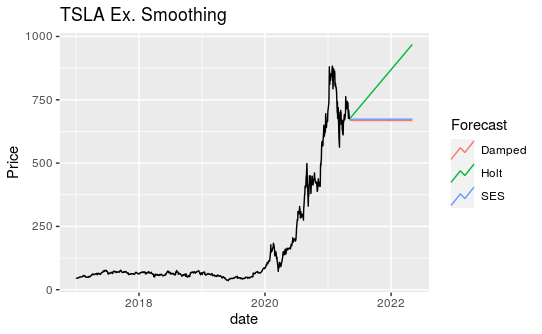
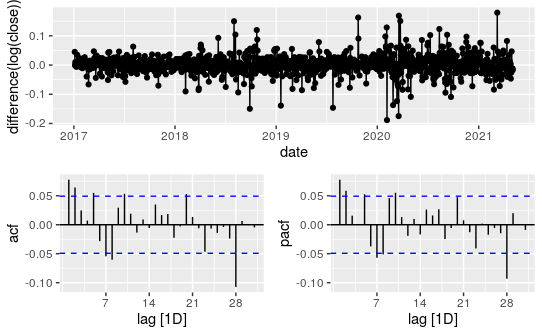
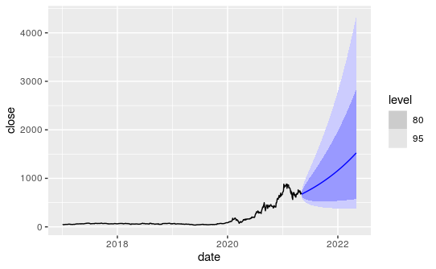
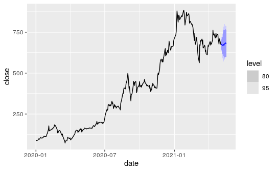

# Time_Series_Project
R Project to Demonstrate Time Series Forecasting on Tesla Stock Data

## Table of Contents
* [General Info](#general-information)
* [Technologies Used](#technologies-used)
* [Launch](#launch)
* [Screenshots](#screenshots)

## General Information
- This project was my final project for my Stats 474: Time Series class at Cal State East Bay.  Professor Eric Suess was my professor for this class, and he has given me permission to use this project as a demonstration of Time Series Forecasting.

Format of the Project:

"Find a monthly (or weekly) time series data set of interest to you that contains at least two time series to work with to make forecasts for the next 12 months.

Build the following models for at least two time series and use them to forecast the next 12 months.

1. Build a linear regression model using TSLM().
2. Build an appropriate exponential smoothing model.
3. Build an SARIMA model.
4. Build a neural network.

In your R Notebook show the the fitted values on a time plot and show your forecasts with errors."

- The description of the project is very loose and minimal.  The point of the project was to take the code and principals learned from class (and learned from the book "Forecasting: Principles and Practice") and apply them to stock data of my choosing.  I chose Tesla because I was fascinated with the current boom of stock once Tesla went public.  Elon Musk is a very fascinating man to me.

## Technologies Used

- R (4.0.3)
  - Tidyverse
  - fpp3: Data for "Forecasting: Principles and Practices" book.  Packages to run Time Series functions also included.
  - quantmod: "Quantitative Financial Modelling and Trading Framework for R"
  - Tidyquant:  Used to import stock data from the web into R Studio
  - imputeTS: Used to impute missing values in Time Series.  This makes sense for stock data, as there are days in which the stock market is closed (weekends, holidays)

## Launch

- Download .Rmd and import into R.  Make sure to download the packages listed in "Technologies Used"

## Screenshots

